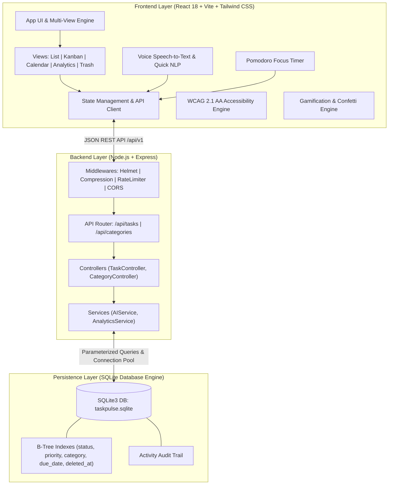
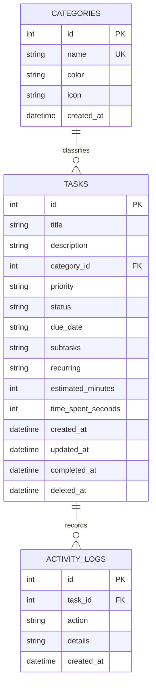

# 🏛️ TaskPulse Architecture & Technical Design

This document details the architectural blueprint, design principles, database schema, security provisions, and data flows of **TaskPulse Enterprise v2.0**.

---

## 🏗️ 1. High-Level System Architecture

---

## 📊 2. Database Entity-Relationship (ER) Schema

---

## 🛡️ 3. Security, Scalability & Resilience

| Pillar | Implementation Details |
|---|---|
| **Security Headers** | `helmet` protects against XSS, clickjacking, MIME-sniffing, and SSL downgrade. |
| **Rate Limiting** | `express-rate-limit` mitigates brute-force, scrape, and denial-of-service attempts (1000 req/15m). |
| **SQL Injection Defense** | 100% Parameterized queries with prepared statements through SQLite driver wrappers. |
| **Payload Compression** | Gzip & Brotli HTTP payload compression with `compression`. |
| **Database Performance** | Indexed lookups on query filters (`status`, `priority`, `category_id`, `due_date`, `deleted_at`). |
| **Soft Deletes & Recovery** | Tasks use `deleted_at` timestamp enabling instant recovery from the Trash Bin. |

---

## 🤖 4. AI & NLP Decomposition Engine

The integrated **AI Subtask Generator (`aiService.js`)** performs automated goal decomposition:
- **Heuristic Pattern Matching**: Detects actionable verbs (e.g. *Deploy, Design, Study, Workout, Grocery*) and breaks them down into ordered subtasks.
- **Time Estimation**: Automatically estimates focus duration per subtask.
- **Natural Language Parsing**: Analyzes strings like `"Submit audit slides by tomorrow !urgent #Work"` into structured fields.
