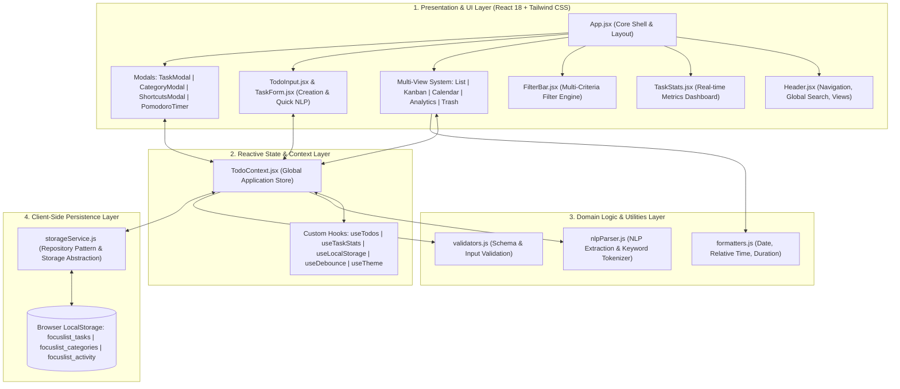
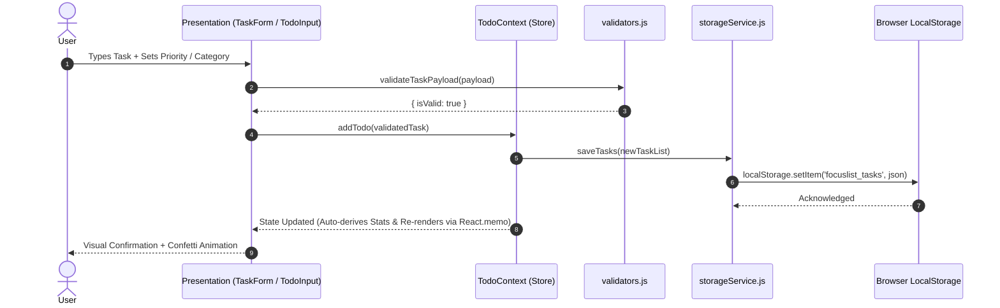

# 🏛️ FocusList Architecture & System Design Document

This document outlines the technical architecture, design patterns, state management models, component hierarchy, accessibility compliance, and performance strategies of **FocusList Enterprise**.

---

## 📐 1. System Overview & Layered Architecture

FocusList is engineered as a **100% Client-Side Single Page Application (SPA)** with zero server dependencies, guaranteeing instant response times, complete offline capability, and client-side data sovereignty.

---

## 🔄 2. State Lifecycle & Data Flow

---

## 🧩 3. Component Hierarchy & Dependency Map

- **`App.jsx`**: Top-level coordinator, route resolution, dark/light theme management, error boundary boundary.
  - **`Header.jsx`**: Global branding, full-text search input with speech-to-text voice recognition, view tabs, backup import/export triggers.
  - **`GamificationBar.jsx`**: Productivity streak metrics and daily completion goals.
  - **`TaskStats.jsx` / `TaskStatistics.jsx`**: Memoized aggregate dashboard (`Total Tasks`, `Completed Tasks`, `Pending Tasks`, `Completion Rate`).
  - **`TodoInput.jsx` / `TaskForm.jsx`**: Fast inline input with NLP tag expansion (`!urgent`, `#Work`, `today`).
  - **`FilterBar.jsx` / `TaskFilter.jsx`**: Status tabs (`All`, `Active`, `Completed`), category chips, priority selectors, and date ranges.
  - **`TaskList.jsx` / `TodoList.jsx`**: Virtualizable drag-and-drop task item container.
    - **`TaskItem.jsx` / `TodoItem.jsx`**: Memoized task card with subtask checklist, priority badges, and inline actions.
  - **`KanbanBoard.jsx`**: Visual board view categorized by status columns.
  - **`CalendarView.jsx`**: Monthly calendar agenda view.
  - **`AnalyticsView.jsx`**: Visual completion metrics, category distribution, and time tracking.
  - **`TrashView.jsx`**: Soft-delete archive with instant restore or permanent purge.
  - **`PomodoroTimer.jsx`**: Focus work interval timer linked to task time tracking.

---

## ♿ 4. Accessibility & WCAG 2.1 AA Compliance

| Accessibility Feature | Implementation Standard |
|---|---|
| **Semantic Landmarks** | Strict usage of `<header>`, `<main>`, `<nav>`, `<section>`, `<article>`, and `role="region"`. |
| **ARIA Annotations** | Dynamic `aria-label`, `aria-checked`, `aria-expanded`, `aria-live="polite"`, `aria-modal="true"`. |
| **Keyboard Navigability** | Full tab-stop sequence, focus rings (`focus-visible:ring-2`), and `Enter`/`Space`/`Escape` key handlers. |
| **Color Contrast** | Minimum 4.5:1 text-to-background contrast ratio across dark and light modes. |
| **Screen Reader Friendly** | Visual icons accompanied by descriptive labels or `.sr-only` utility wrappers. |

---

## ⚡ 5. Performance Optimization Strategy

1. **Code-Splitting via `React.lazy` & `Suspense`**: Heavy views (`AnalyticsView`, `CalendarView`, `KanbanBoard`, `PomodoroTimer`) load dynamically on demand.
2. **Component Memoization (`React.memo`)**: Eliminates redundant re-renders across list items, stats widgets, and filter bars.
3. **Reactive Computation (`useMemo`)**: Aggregates and filter results compute in $O(N)$ only when underlying arrays or queries change.
4. **Debounced Search (`useDebounce`)**: Prevents UI stutter during high-velocity keyboard typing.
5. **Optimized Asset Bundling**: Rollup manual chunking isolates `vendor` (React/ReactDOM), `icons` (Lucide), and `effects` (Canvas Confetti).
