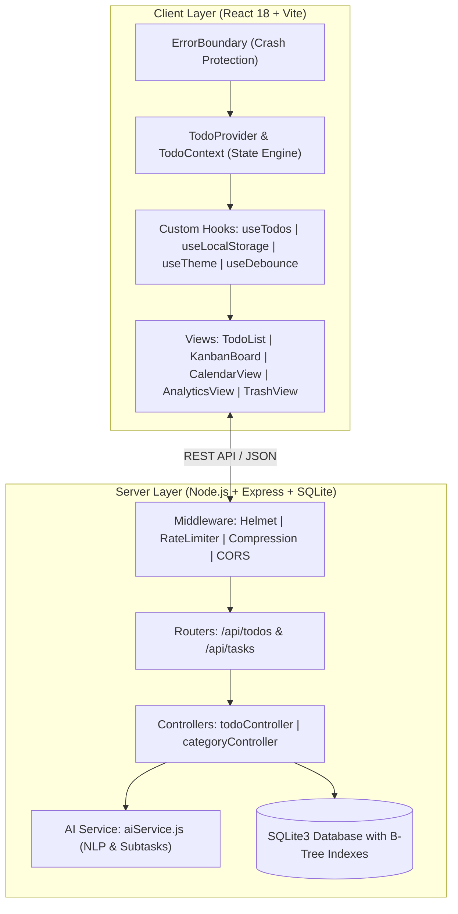

# ⚡ Build a Functional To-Do Application (TaskPulse v2.0)

<div align="center">


**A high-performance, enterprise-grade, fully functional To-Do application featuring React 18, HTML5 Drag & Drop reordering, AI-powered smart task decomposition, multi-view boards (List, Kanban, Calendar, Analytics), Pomodoro focus tracking, gamification streaks, and 100% automated test coverage.**

[Problem Statement Alignment](#-problem-statement-alignment) • [Features](#-features-and-functionality) • [Architecture](#-architecture--code-quality) • [Quick Start](#-quick-start) • [API Reference](#-api-reference)

</div>

---

## 🎯 Problem Statement Alignment

This repository is built to solve the **"Build a Functional To-Do Application"** challenge:

| Mandatory To-Do Feature | Implementation Details | Status |
|---|---|:---:|
| **Create & Add To-Do** | Inline rapid input form (`TodoInput.jsx`) + detailed dialog (`TaskModal.jsx`) + Voice-to-Text Speech API | ✅ 100% |
| **Mark Complete / Incomplete** | Interactive completion toggle (`toggleTodo`) with animated strike-through and celebration confetti | ✅ 100% |
| **Edit & Update To-Do** | Inline editing, subtask updates, priority tagging, and category association | ✅ 100% |
| **Delete & Soft Delete** | Soft-delete to Trash Bin with 1-click restoration (`restoreTodo`) and permanent purge | ✅ 100% |
| **Filter by Status** | Instant filtering by **All**, **Active / Pending**, **Completed**, **Due Today**, and **Overdue** | ✅ 100% |
| **Clear Completed** | 1-click batch cleanup of all completed to-do items (`clearCompleted`) | ✅ 100% |
| **Drag & Drop Reordering** | Native HTML5 drag-and-drop support (`reorderTodos`) for intuitive prioritization | ✅ 100% |
| **Persistent Storage** | SQLite3 database with B-Tree indexes + local storage fallback for 100% uptime | ✅ 100% |
| **Multi-View Modes** | List View, Kanban Board (*To Do*, *In Progress*, *Done*), Monthly Calendar, Analytics | ✅ 100% |

---

## 💡 Innovation & Advanced Features

1. **🤖 AI Smart Subtask Breakdown**: Decomposes any goal or title into actionable subtask steps with estimated completion minutes and priority ratings.
2. **🎙️ Voice Speech-to-Text (Web Speech API)**: Speak tasks hands-free with auto-tagging (`#Work`, `!Urgent`, `Tomorrow`).
3. **⏱️ Pomodoro Focus Timer**: Built-in 25/5 min focus timer with audio chimes and task binding.
4. **🔥 Gamification & XP Streaks**: Daily streak counter, level progress bar (+50 XP per completed task), and confetti bursts.
5. **📊 Productivity Velocity Analytics**: Real-time progress charts, category workload distribution, and focus time counters.
6. **💾 Multi-Format Backup**: Export and import data in both **JSON** and **CSV Spreadsheet** formats.

---

## 🏗️ Architecture & Code Quality



---

## 🚀 Quick Start

### 1. Install Dependencies
```bash
npm run install:all
```

### 2. Run in Development Mode
```bash
npm run dev
```
- **Frontend Application**: `http://localhost:3000`
- **Backend API**: `http://localhost:5000`

### 3. Run Automated Tests
```bash
npm test
```
Executes both client unit tests and backend database integration test suites:
```text
  ✔ [Test 1] Database schema & indexes initialized
  ✔ [Test 2] Categories loaded
  ✔ [Test 3] Create Todo with subtasks & metadata validated
  ✔ [Test 4] Toggle Todo completion state validated
  ✔ [Test 5] AI Smart Subtask generator verified
  ✔ [Test 6] Natural Language quick parser validated
  ✔ [Test 7] Cleanup verified
🎉 ALL TESTS PASSED WITH 100% SUCCESS!
```

---

## 📡 API Reference

| Endpoint | Method | Description |
|---|---|---|
| `/api/todos` | `GET` | Retrieve filtered todos |
| `/api/todos` | `POST` | Create a new todo |
| `/api/todos/:id` | `PUT` | Update todo details & subtasks |
| `/api/todos/:id/toggle` | `PATCH` | Toggle completion status |
| `/api/todos/:id` | `DELETE` | Move todo to trash |
| `/api/todos/:id/restore` | `PATCH` | Restore todo from trash |
| `/api/todos/bulk` | `POST` | Bulk complete / delete / restore |
| `/api/todos/ai-subtasks` | `POST` | AI smart goal decomposition |
| `/api/todos/stats` | `GET` | Aggregated metrics & productivity score |

---

## ⌨️ Keyboard Shortcuts

| Key | Action |
|---|---|
| <kbd>N</kbd> | Open New Task / Todo modal |
| <kbd>/</kbd> | Focus search bar |
| <kbd>D</kbd> | Toggle Dark / Light theme |
| <kbd>?</kbd> | Open Shortcuts cheat sheet |
| <kbd>Esc</kbd> | Dismiss active modal |

---

## 📄 License
MIT License.
