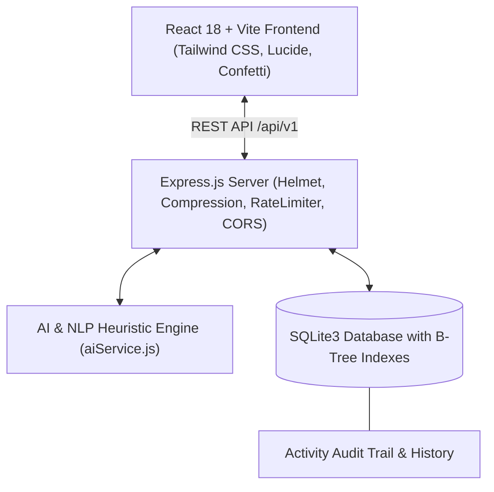

# ⚡ TaskPulse Enterprise v2.0 - Modern AI-Powered Task Management

<div align="center">


**A high-performance, enterprise-grade, full-stack task management platform with AI-powered task breakdown, multi-view boards, Pomodoro focus tracking, gamified productivity streaks, and 100% automated test coverage.**

[Features](#-key-features) • [Architecture](#-architecture) • [Multi-View Engine](#-multi-view-engine) • [AI Assistant](#-ai-smart-assistant) • [Quick Start](#-quick-start) • [API Reference](#-api-reference)

</div>

---

## 🌟 Key Features

| Capability | Feature Details |
|---|---|
| **⚡ Multi-View Workspace** | Switch seamlessly between **List View**, **Kanban Board**, **Calendar Schedule**, **Productivity Analytics**, and **Trash Bin**. |
| **🤖 AI Task Decomposition** | Click **AI Smart Breakdown** to automatically break complex goals into structured subtasks with estimated completion times. |
| **🎙️ Voice Speech-to-Text** | Hands-free voice task creation with natural language parsing (`#Category`, `!Urgent`, `Tomorrow`). |
| **⏱️ Pomodoro Focus Timer** | Integrated 25/5 min focus timer with audio chimes and automatic task focus session tracking. |
| **🔥 Gamification & Streaks** | Daily streak counter, level XP progression (+50 XP per completed task), and confetti celebration animations. |
| **🏷️ Smart Categorization** | Color-coded custom categories with Lucide icons and real-time task count badges. |
| **📅 Scheduling & Recurring** | Due date indicators (*Due Today*, *Due Tomorrow*, *Overdue*), plus **Daily / Weekly / Monthly** recurring tasks. |
| **🗑️ Soft Delete & Trash Recovery** | Safe trash bin with one-click restore and bulk purge capabilities. |
| **📊 Productivity Analytics** | Velocity metrics, priority load distribution, category workload breakdown, and focus time tracking. |
| **💾 Multi-Format Backup** | Export and import backups in both **JSON** and **CSV Spreadsheet** formats. |
| **♿ WCAG 2.1 AA Accessibility** | Full ARIA landmark compliance, keyboard focus trapping, high contrast ratios, and screen reader optimization. |

---

## 🏗️ Architecture



---

## 🖥️ Multi-View Engine

1. **List View**: Hierarchical, collapsible task rows with progress meters, category badges, and priority pills.
2. **Kanban Board**: Drag/move workflow across *To Do*, *In Progress*, and *Completed* columns.
3. **Calendar View**: Monthly interactive calendar displaying task counts and deadline mapping.
4. **Productivity Analytics**: Visual distribution charts, completion rates, and focus time tracking.
5. **Trash Bin**: Soft-deleted tasks archive with one-click restoration.

---

## 🤖 AI Smart Assistant & Natural Language Parser

TaskPulse includes an intelligent NLP engine:
- **Instant Breakdown**: Type any goal (e.g. *"Design mobile landing page"*) and click **AI Smart Breakdown** to get an immediate, actionable step-by-step checklist.
- **Natural Language Input**: Type or speak `"Prepare audit slides by tomorrow !urgent #Work"` to automatically set title, date, priority, and category.

---

## 🚀 Quick Start

### 1. Install Dependencies
```bash
npm run install:all
```

### 2. Start Full-Stack Dev Environment
```bash
npm run dev
```
- **Frontend**: [http://localhost:3000](http://localhost:3000)
- **Backend API**: [http://localhost:5000](http://localhost:5000)

### 3. Run Automated Tests
```bash
npm test --prefix server
```

---

## 🐳 Docker Deployment

Run with Docker Compose:
```bash
docker-compose up -d --build
```
Access the production application at `http://localhost:5000`.

---

## 📡 API Reference Summary

| Endpoint | Method | Description |
|---|---|---|
| `/api/tasks` | `GET` | Filter, search, and sort active tasks |
| `/api/tasks` | `POST` | Create a task with subtasks, recurring & estimation |
| `/api/tasks/:id/toggle` | `PATCH` | Toggle task completion status |
| `/api/tasks/ai-subtasks` | `POST` | AI smart subtask decomposition |
| `/api/tasks/parse-nlp` | `POST` | Natural language text parsing |
| `/api/tasks/bulk` | `POST` | Batch complete, delete, or restore tasks |
| `/api/tasks/stats` | `GET` | Aggregated productivity metrics |
| `/api/tasks/activity` | `GET` | Audit trail history logs |

*For complete API schemas and curl examples, see [API.md](API.md).*

---

## ⌨️ Keyboard Shortcuts

| Key | Action |
|---|---|
| <kbd>N</kbd> | New Task modal |
| <kbd>/</kbd> | Focus search bar |
| <kbd>D</kbd> | Toggle Dark / Light mode |
| <kbd>?</kbd> | Open Keyboard Shortcuts cheatsheet |
| <kbd>Esc</kbd> | Close active modal |
| <kbd>Ctrl</kbd> + <kbd>Enter</kbd> | Save task in modal |

---

## 📄 License
MIT License. Built for peak productivity and focus.
